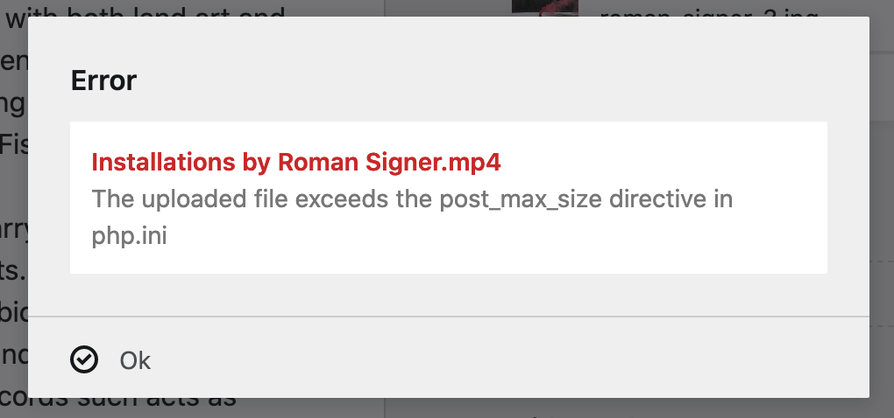

# Kirby Stuff

Here I will upload some of the code we wrote together and add some helpfull code snippets.

## Code We Wrote Together

The Content Folder

```
content
|
└─── projects // your project folder
     |
     └─── projects.txt
     |
     └─── 1_project-a // one of your projects
          |
          └─── project-entry.txt // your project description, urls etc.
          |
          └─── roman-signer.jpg // your images
          |
          └─── roman-signer.jpg.txt // your image caption

``` 

## Your video files are too big?



To solve this error, you need first to find your `php.ini` file. To find the file there is a simple trick, copy paste the following code into one of your templates `<?php phpinfo(); ?>`. No go to your page and reload. You will see all the information about your PHP version. You can see the path to your `php.ini` file under **Loaded Configuration File**. For example this could be `/Applications/MAMP/bin/php/php7.3.1/conf/php.ini`.

Locate the file and open it. Now edit the `post_max_size = 8M` to a large number like `post_max_size = 178M`


